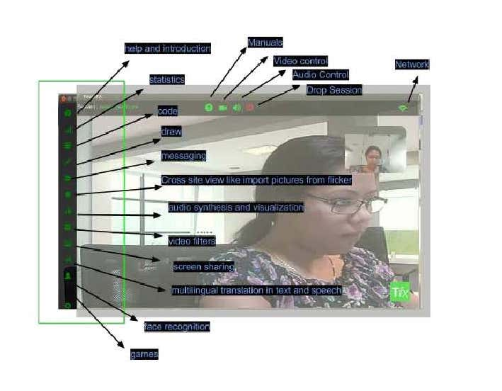

# TangoFX Sessions

Lightweight , secure , plug and play platform for peer-to-peer Internet calling

- CaaS ( Communication as a platform)  
- highly customizable platform 
- Build on Opensource Chrome Developer tools , WebRTC , sipML5 , socketio , nodejs
- immensely interactive tools 
- SDK to devlop addon widgets

## Widgets 



## Run

### web Server

directory : tfx_web
role: starts thttps server to render the webpages 

```js
> tfx_web git:(master) ✗ node webrtcserver.js 
Folder Path  /home/altanai/tfx/tfx_module { root: '/home/altanai/tfx/tfx_module',
  options: 
   { cache: 3600,
     gzip: true,
     indexFile: 'index.html',
     headers: { server: 'node-static/0.7.6', 'cache-control': 'max-age=3600' } },
  cache: 3600,
  defaultHeaders: { server: 'node-static/0.7.6', 'cache-control': 'max-age=3600' },
  serverInfo: 'node-static/0.7.6' }
 WebRTC server env => local running at
 8084/
 CTRL + C to shutdown
```

### Signalling Server

directory : tfx_signaller
role: starts the signaller server using socketio on https for secure webrtc 

should run

> cd tfx_signaller
> NODE_ENV=production node server.js
-- signal master is running at: https://localhost:8888


### Web Client

goto url : https://localhost:8084

### Web Extension

make a zip and install to chorme -> settings -> extensions

### Docuemntation 

directory : tfx_homepage
role: docuemntaion for tfx whic can be started by http-server  cmd in directory 

```
➜  tfx_homepage git:(master) ✗ http-server   
Starting up http-server, serving ./
Available on:
  http://127.0.0.1:8080
  http://192.168.1.116:8080
Hit CTRL-C to stop the server
```

## Media Coverage 

Whitepaper Acdemiz.edu - https://www.academia.edu/11925353/TangoFX_Sessions_WebRTC_Chrome_Extension

TangoFX session Linkedin - https://www.linkedin.com/pulse/tangofx-sessions-altanai-bisht/

businessinsider - https://www.businessinsider.in/the-entrepreneurwho-wants-to-make-a-difference-in-the-indian-society/articleshow/44970790.cms